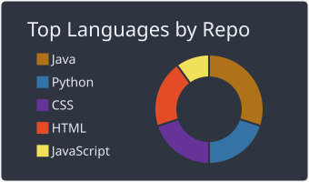
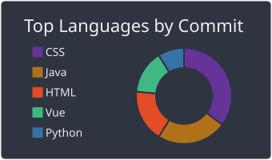
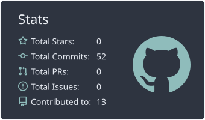
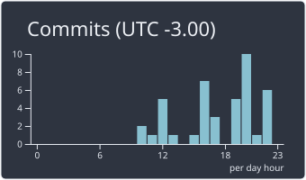

<!-- ============ CABEÇALHO ============ -->

<!-- Texto animado: edite as frases separando com ; e use + no lugar de espaço -->

 

---

# 👋 Sobre Mim

* 📚 **Estudante de ADS**
* 💼 **Cursando Análise e Desenvolvimento de Sistemas no Senai**
* 🔭 **Atualmente estudando:** Back-End (Java), Computação em Nuvem (AWS), Automação Industrial, Ciência de Dados, Frameworks Front-End(Vue.js)
* 🌱 **Iniciando carreira, em busca do primeiro emprego**
* 🎯 **Meta atual:** conseguir uma vaga de estágio em desenvolvimento
* 👾 **Disposto a desafios!**

---

## 🌐 Redes Sociais e Contato

📫 **E-mail para contato:** `brito.phenrique@gmail.com`

---

## 💻 Tecnologias e Ferramentas

### 🚀 Linguagens

### ⚙️ Frameworks & Runtime

### ☁️ Cloud & Banco de Dados

### 🛠️ Ferramentas & Design

---

## 📊 Estatísticas do GitHub

<!--
  Estes cards são GERADOS PELO GITHUB ACTIONS (arquivo .github/workflows/profile-summary-cards.yml)
  e salvos como imagens dentro do próprio repositório. Não dependem de serviços externos.
  Enquanto o workflow não rodar pela primeira vez, as imagens não aparecem.
  Para trocar o tema, mude "nord_dark" nos caminhos abaixo (ex: github_dark, tokyonight, radical, dracula).
-->

<!-- Linguagens: por repositório e por commits -->

 

<!-- Estatísticas gerais e horário de produtividade -->

 

<!-- Sequência de contribuições (este serviço está funcionando) -->

---

## 🎓 Formação e Certificações

* 🎓 **Curso Técnico Análise e Desenvolvimento de Sistemas**, Senai (2024 - 2025)
* 🎓 **Curso Superior Análise e Desenvolvimento de Sistemas**, Senai (Em andamento)

---

## 🤝 Vamos conversar?

Estou aberto a **oportunidades de estágio e primeiro emprego** na área de tecnologia. Se você tem uma vaga, um projeto ou só quer trocar ideia sobre código, me chame pelo LinkedIn ou por e-mail!

